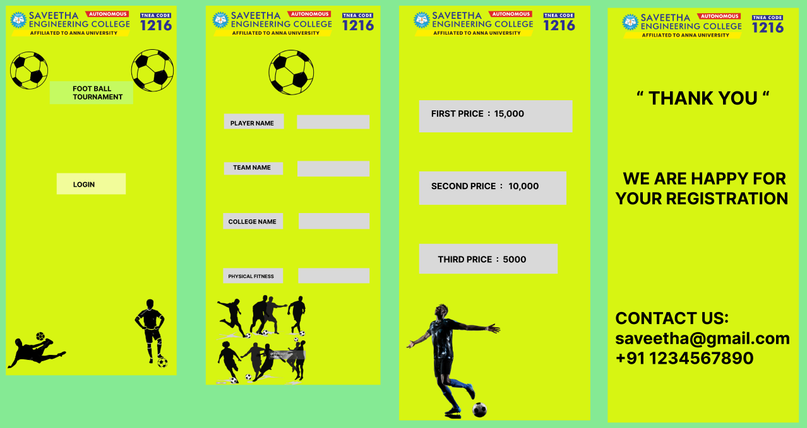

# Ex09 Event Registration Web Application
## Date:02.11.25

## AIM:
To design, develop and deploy a web application for event registration.

## DESIGN STEPS:

### Step 1:
Create a new frame.

### Step 2:
Select any one preset size of your choice.

### Step 3:
Select the shapes you need.

### Step 4:
Import images as needed.

### Step 5:
Create pages based on your need and link them.

### Step 6:

Validate the HTML and CSS code.

### Step 6:

Publish the website in the given URL.

## DESIGN TOOL:
Figma

## CODE:
```
<!DOCTYPE html>
<html>
<head>
  <title>Football Tournament</title>
  <style>
    body { font-family: Arial; background: #d9ff00; text-align: center; padding: 20px; }
    .box { margin: 20px auto; padding: 20px; width: 250px; background: #fff; border-radius: 10px; }
    input, button { margin: 10px 0; padding: 8px; width: 100%; }
  </style>
</head>
<body>

  <div class="box">
    <h3>Saveetha Engineering College</h3>
    <p>FOOTBALL TOURNAMENT</p>
    <button>Login</button>
  </div>

  <div class="box">
    <input type="text" placeholder="Player Name">
    <input type="text" placeholder="Team Name">
    <input type="text" placeholder="College Name">
    <input type="text" placeholder="Physical Fitness">
  </div>

  <div class="box">
    <p>First Prize: ₹15,000</p>
    <p>Second Prize: ₹10,000</p>
    <p>Third Prize: ₹5,000</p>
  </div>

  <div class="box">
    <p>Thank You</p>
    <p>We are happy for your registration</p>
    <p>Contact: saveetha@gmail.com<br>+91 1234567890</p>
  </div>

</body>
</html>

```
## OUtput:



## RESULT:
The program to design, develop and deploy a web application for event registration is completed successfully.
